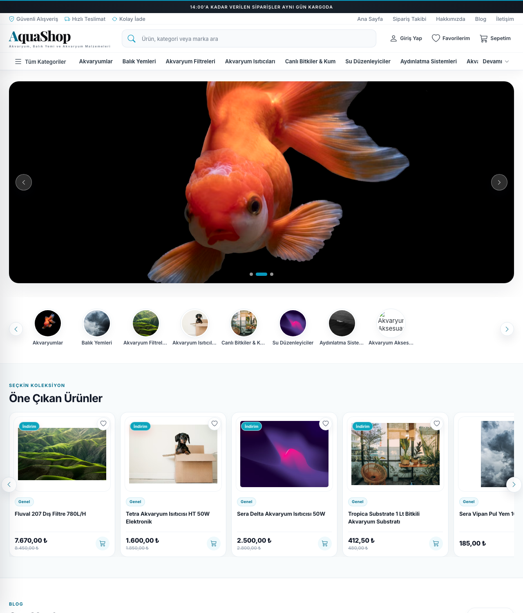
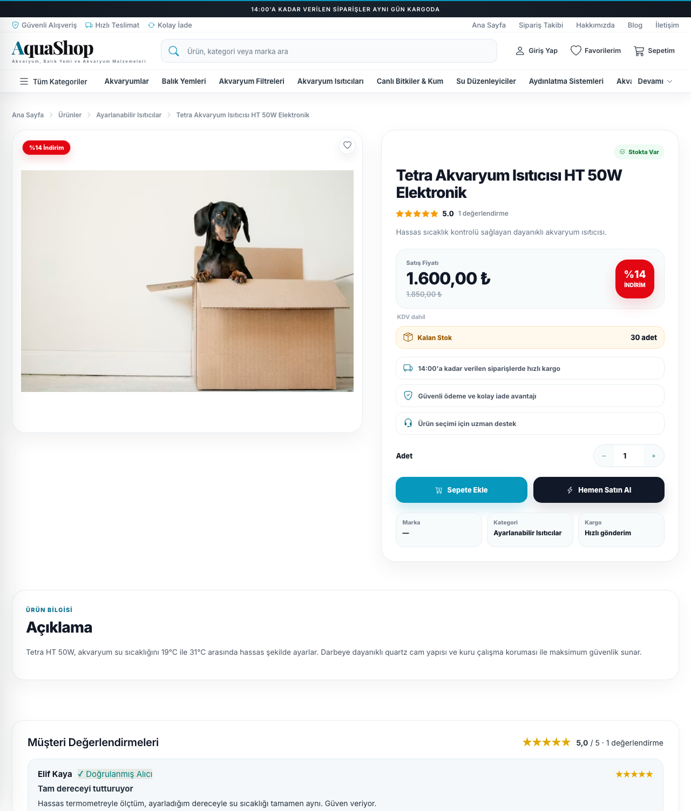
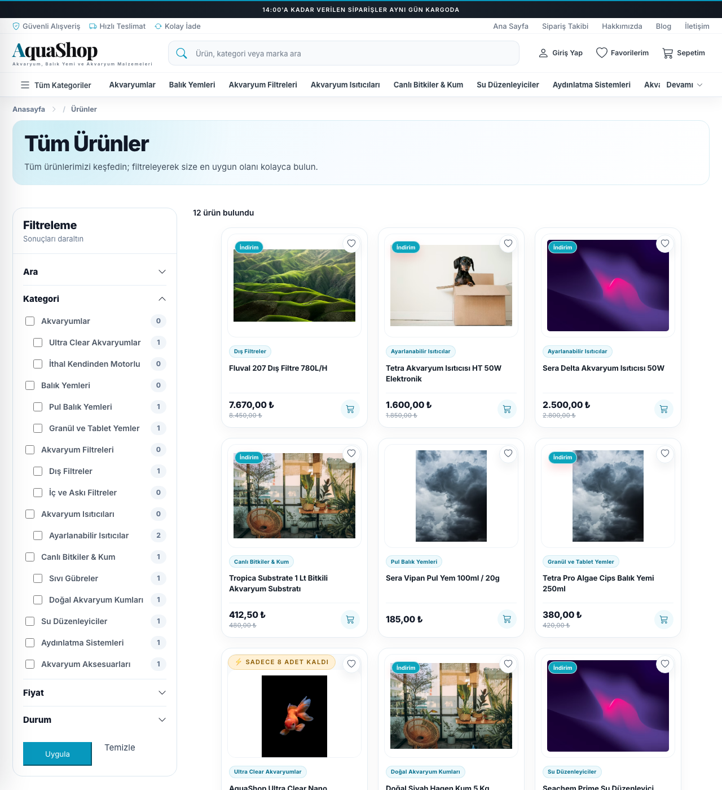
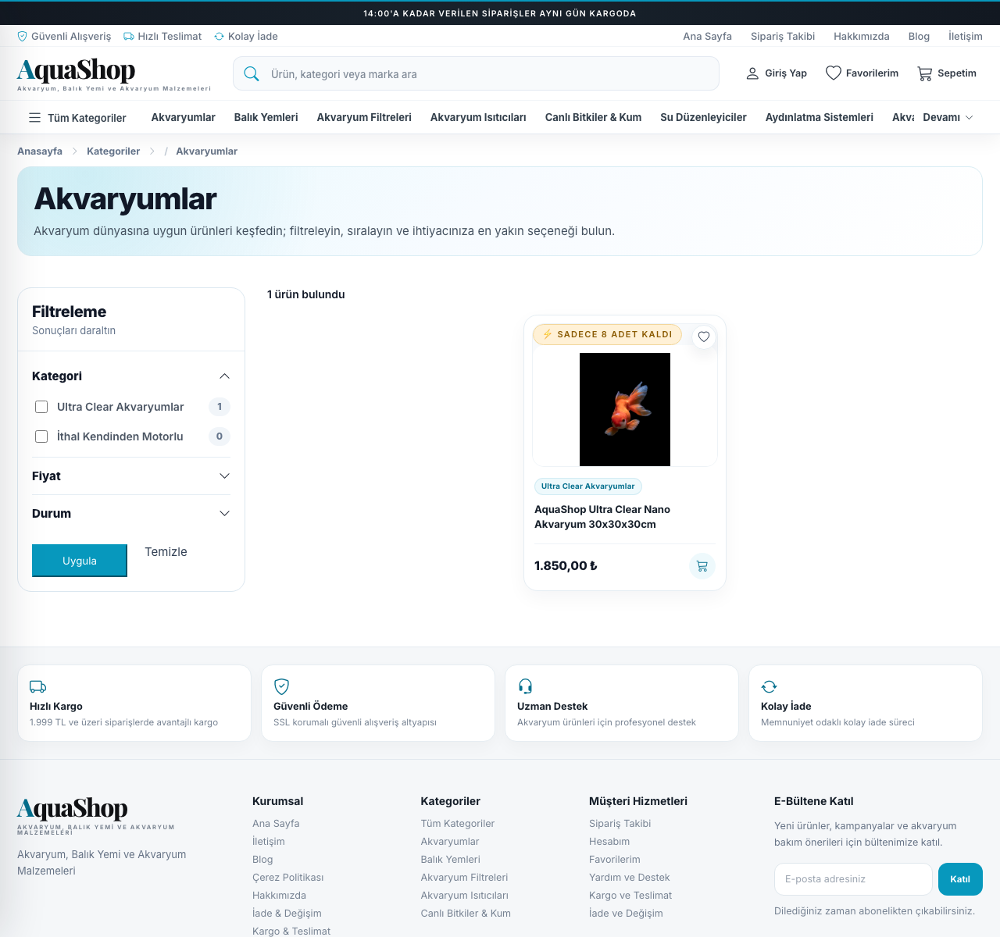
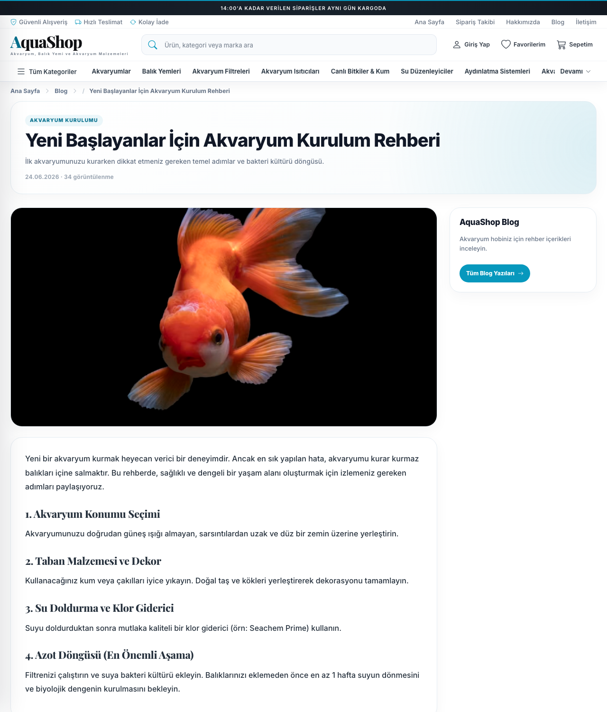
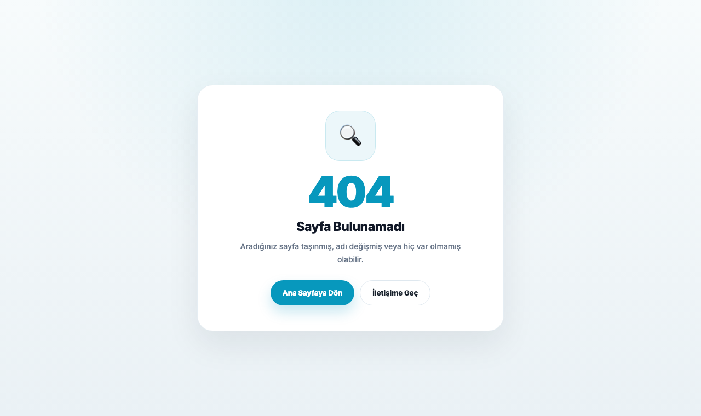

# Ekran Görüntüleri — Aqua Tasarım Tamamlama

Bu klasördeki görüntüler son aqua tasarım çalışmasını belgeler (yerel ortamda alınmıştır).

## Anasayfa

Hero rotatör + kategori carousel + **Öne Çıkan Ürünler** yatay carousel. Bu çalışmayla
**Favoriler**, **Beğenebileceğiniz Ürünler** ve **Son Yazılar** bölümleri de aynı yatay
kayan carousel yapısına geçti; tüm ürün ve blog kartları tek tip **260px**.

## Ürün Detay

Canlı `aquashop.com.tr` ürün detay tasarımıyla birebir: galeri + satın-alma kutusu
(Stokta Var rozeti, fiyat/indirim, Kalan Stok, avantaj satırları), adet kontrol,
**Sepete Ekle** + **Hemen Satın Al**, açıklama kartı, SSS akordeon, benzer ürünler carousel.

## Ürün Listesi (`/urun`)

Kategori sayfasıyla **aynı filtre sidebar** (Filtreleme / Sonuçları daraltın — açılır
Ara/Kategori/Marka/Fiyat/Durum grupları) + 260px aqua ürün kartları.

## Kategori

Aqua hero kart + filtre sidebar + ürün grid (referans filtre tasarımı).

## Blog Yazısı

`aq-blog-detail` aqua düzeni: chevron breadcrumb, başlık kartı, 2 kolon (içerik + sidebar),
benzer ürünler carousel.

## Hata Sayfası (404)

Temaya uygun bağımsız hata sayfaları — **404 / 403 / 401 / 500 / 503** aynı aqua şablonu
(her kod için farklı ikon/renk/mesaj) kullanır.
